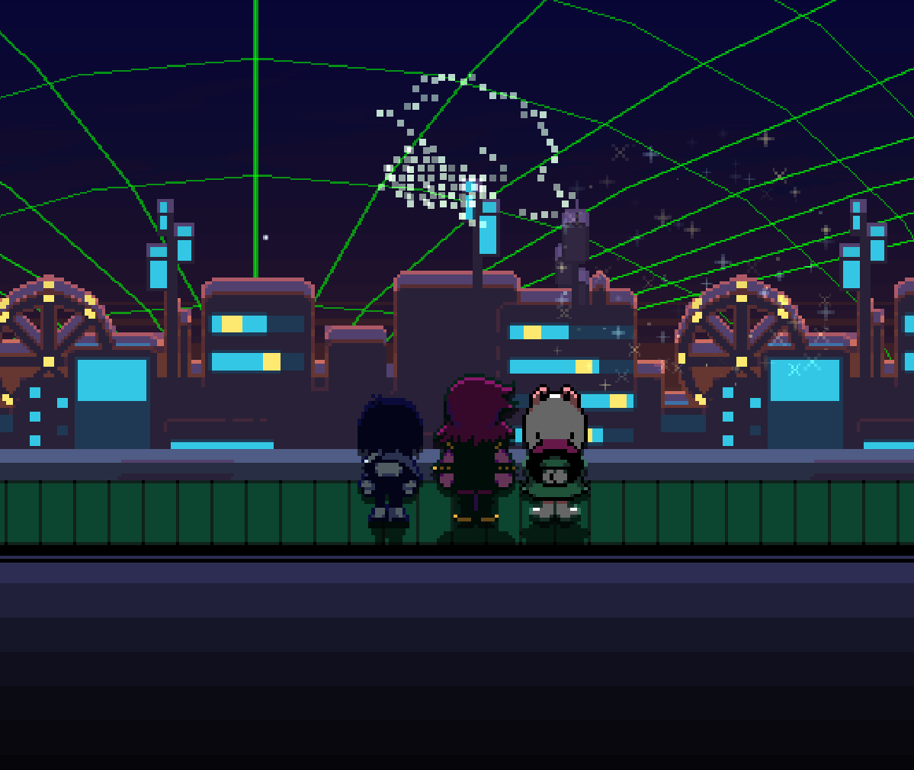

<table>
  <tr>
    <td style="padding-right: 20px; vertical-align: top;">
      <h2>Soy Germán Uriel Evangelista Martínez (chermann)</h2>
      <em>"Intento programar."</em>
      

        Actualmente soy <strong>estudiante de bachillerato</strong>, autodidacta y apasionado por la tecnología.  
        He trabajado por mi cuenta en proyectos que combinan <strong>software, electrónica y otros gustos y pensares míos</strong>,  
        buscando resolver problemas reales o simplemente aprender algo nuevo.  
        No tengo título (todavía), pero sí <strong>ganas de hacer las cosas bien</strong>. 
        (en realidad casi nunca uso GitHub, pero intento que no se vea mal)
      

    </td>
    <td style="padding-left: 20px; vertical-align: top;" width="40%">
      
    </td>
  </tr>
</table>

---
## 🚀 Proyectos que estoy desarrollando

### [🧠 Casandra](https://github.com/germann-ux/Casandra)  
Sistema de análisis de datos delictivos del estado de Guanajuato con IA, gráficas y reportes técnicos.

- Análisis estadístico automatizado
- Visualizaciones ejecutivas en HTML
- Generación de conclusiones con IA (Gemini 2.5)

---

### [📘 ACC - Aprendiendo C# con Charp](https://github.com/germann-ux/ACC-Complex)  
Una plataforma educativa en Blazor para aprender C# desde cero con IA, prácticas, agenda, evaluaciones y más.

- Aprendizaje progresivo con bloques interactivos
- Asistente educativo Charp (IA especializada)
- Arquitectura modular, moderna y open-source

---

### [💼 Mi CV Web](https://github.com/germann-ux/MiCV)  
Portafolio personal diseñado desde cero, sin frameworks, totalmente responsivo.

- Diseño limpio y lineal
- Cada sección hecha con intención
- En constante evolución

---

### [💸 .NET sin tarjeta](https://github.com/germann-ux/dotnet-sin-tarjeta)  
Guía práctica para usar el ecosistema .NET sin gastar dinero, ideal para estudiantes o entornos sin tarjeta de crédito.

- Uso de Aspire, Docker, herramientas locales
- Alternativas a Azure y servicios pagos
- Pensado desde mi propia experiencia

---

## 📊 Estadísticas

---

## 🧠 Sobre mí

- 🧪 Me gustan Los experimentos
- 🧰 La ingenieria en general me da curiosidad
- 🕹️ Los videojuegos son mi pasatiempo

---

## 📫 ¿Dónde encontrarme?

| Plataforma | Enlace |
|-----------|--------|
| GitHub | [@germann-ux](https://github.com/germann-ux) |
| CV Web | [germann-ux.github.io/MiCV/](https://germann-ux.github.io/MiCV/) |
| Correo | germanev123@gmail.com|

---

## 🧩 cosas que me gustan?
- los gatos y perros.
- la pizza.
- undertale y deltarune.
- en general el conocer nuevas cosas.

Gracias por pasarte por aquí. Si algo de esto te gustó, comenta, estrella, o simplemente ¡saluda! 😺
